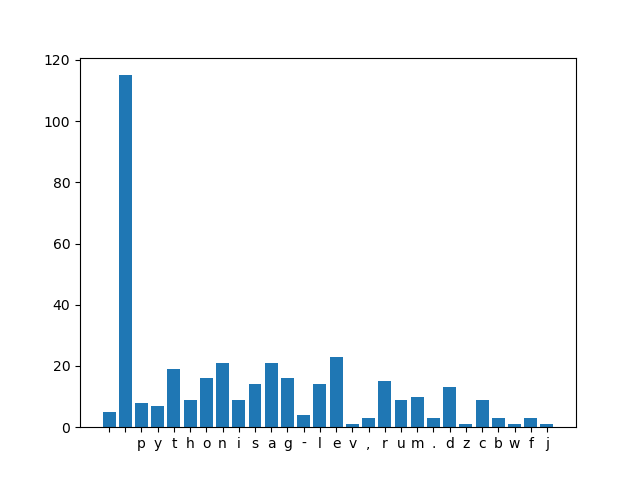
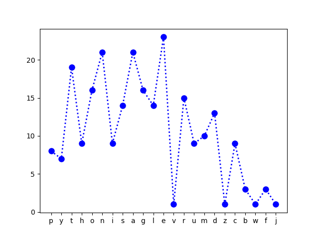

# Data Visualizing using matplotlib

### Matplotlib is a python module/Library for data visualization. Here we are taking a paragraph of text and plotting the characters with the occurrence of the characters. There are many ploting options in matplotlib we are using the basic ones.

### We are using the Pyplot function (collection of functions) available with Matplotlib.

### The plot with all the characters against the number of times they occur.

### The plot with all the newline characters and punctuations removed.

